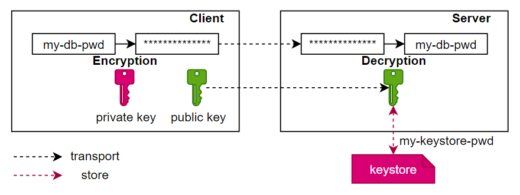

Password Encryption
===================

Overview
-------------------------
openLooKeng manages configuration details in properties files of catalogs. These files may need to include values such as usernames, passwords and other strings, the password often required to be kept secret, that can't be stored as plaintext.
Here is a typical configuration file of a MySQL connector:
```
connector.name=mysql
connection-url=jdbc:mysql://localhost:3306
connection-user=root
connection-password=123456
```
openLooKeng can be configured to enable password encryption, these passwords will be encrypted.

Principle
-------------------------
The asymmetric encryption algorithm (RSA) is used for encrypting password.



* Private Key: for encryption, client can use private key to encrypt plaintext.
* Public Key: for decryption, server store the public key as a keystore file in [filesystem](../develop/filesystem.md), and server can use public key to decrypt the ciphertext.

The user saves the secret key and gives the public key to openLooKeng to decrypt the encrypted ciphertext.

The key suggested size of RSA is 3072 bits, the minimum is 2048 bits.

Configuration
-------------------------

To enable password encryption, you need add these properties in the `etc/config.properties`
```
security.password.decryption-type=RSA
security.key.manager-type=keystore
security.key.keystore-password=my-keystore-pwd
security.key.store-file-path=/openlookeng/keystore/keystore.jks
```

| Property                          | Description                                                  |
| :-------------------------------- | :----------------------------------------------------------- |
| `security.password.decryption-type` | The type of password decryption. Should be set to `NONE` or `RSA`. |
| `security.key.manager-type=keystore`       | The type of password encryption key storage. Should be set to `keystore`. |
| `security.key.keystore-password`          | The password of keystore.                                         |
| `security.key.store-file-path`          | The [filesystem](../develop/filesystem.md) path of keystore file.                                          |

Use Case
-------------------------
### Case 1. Dynamic Catalog
A http request has the following shape (MySQL connector as an example):
```
request: POST/PUT
header: 'X-Presto-User: admin'
form: '
    catalogInformation={
        "catalogName":"mysql",
        "connectorName":"mysql",
        "securityKey":"MIGfMA0GCSqGSIb3DQEBAQUAA4GNADCBiQKBgQC1Z4yap2cI1u6zg/R8vTcltOy8xxeOt/VG0xEArud+c5rI9h2kWy8Uo7hTFN/JapVDENT17fEzd+SqrlvcmD8ceDH07+OW2RRGcQjR0GKpKGSmubEHdH01xzpuQ1+m83B84Ir5eqcWx6QIwBPQsqqjeNpHhYdJLMpSrX1V+c7UUQIDAQAB",
        "properties":{
            "connection-url":"jdbc:mysql://localhost:3306",
            "connection-user":"root",
            "connection-password":"iRSxl1KNY06d34JGLooey0re4akzr+iJlTz1eCK1hEq8aYaX1SlzANCF7KTq6o2cF71OjINGvNjR0DXRed6gu3QYODw1Src0wiY0OvO9xfcffVt2rFvM/o238MJz1yhIcPn1BrrEgW5qVjzbbvzkS/fX+pTDqKNGAd3qefDLCuc=",
            "encrypted-properties":"connection-password",
        }
    }
'
```
* `securityKey`: The public key.
* `connection-password`: The ciphertext encrypted with private key.
* `encrypted-properties`: The encrypted property names.

Check [dynamic catalog](../admin/dynamic-catalog.md) for more information.