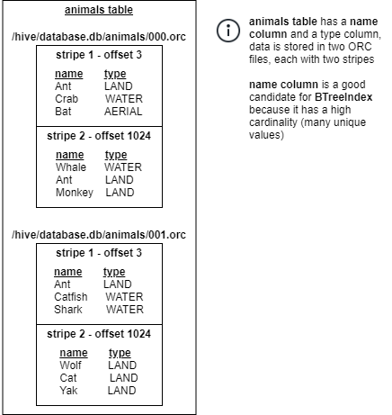
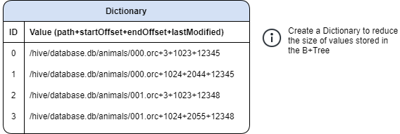

# BTreeIndex

BTreeIndex使用二叉树数据结构存储。索引的大小随着索引列中不同值的个数而增加。

BTreeIndex利用B+Tree数据结构来允许在调度期间进行过滤。

BTreeIndex与BloomIndex相似，并且对于具有高基数的列非常适用。
但是，索引的大小可能会很大，因为索引的大小会随着数量的增加而增加
列中独特值的百分比增加。

B+Tree的建立构造使用独特列值作为键，并且可以在其中找到该列值的值。
为了减小索引的大小，将为这些值创建一部Dictionary，因此不需要将大型重复项存储多次。

与BloomIndex不同，BTreeIndex还可以使用以下运算符来支持范围查询
大于（`>`），小于（`<`），`BETWEEN`等。

## 使用场景

**注意：当前，启发式索引仅支持ORC存储格式的Hive数据源。**

BTreeIndex用于调度时的分片(Split)过滤，被coordinator节点使用。

## 选择适用的列

在具有高基数（即许多独特值）条件的列上具有过滤predicate的queries可以从BTreeIndex中达到好的效果。

例如，类似`SELECT FROM FROM users WHERE phone>123456789`的query
可以通过在`phone`列上使用BTreeIndex而达到好的效果，因为
列中的数据已被过滤，`phone`列的基数较高。

在BTreeIndex和BloomIndex索引之间选择时，需要考虑：
- BloomIndex只支持`=`，而BTreeIndex提供范围咨询
- BloomIndex是不确定的，而BTreeIndex是确定的。因此BTreeIndex通常有更好的过滤性能
- BTreeIndex比BloomIndex索引更大

## 支持的运算符

    =       Equality
    >       Greater than
    >=      Greater than or equal
    <       Less than
    <=      Less than or equal
    BETWEEN Between range
    IN      IN set

## 支持的列类型
    "integer", "smallint", "bigint", "tinyint", "varchar", "real", "date"

## 用例

**创建索引:**

```sql
create index idx using btree on hive.hindex.orders (orderid) with (level=table)';
create index idx using btree on hive.hindex.orders (orderid) with (level=partition) where orderDate='01-10-2020';
create index idx using btree on hive.hindex.orders (orderid) with (level=partition) where orderDate in ('01-10-2020', '01-10-2020');
```

* 假设表已按照`orderDate`列分区

**使用索引:**
```sql
select * from hive.hindex.orders where orderid=12345
select * from hive.hindex.orders where orderid>12345
select * from hive.hindex.orders where orderid<12345
select * from hive.hindex.orders where orderid>=12345
select * from hive.hindex.orders where orderid<=12345
select * from hive.hindex.orders where orderid between (10000, 20000)
select * from hive.hindex.orders where orderid in (12345, 7890)
```

## 如何创建BTreeIndex

1. BTreeIndex在表级别（table level）（如果表已分区，则在分区级别）创建。
2. 数据作为`<Key,Value>`对插入。`Keys`是列值，`Values`是包含列值的Stripes。
   对于下面的示例，数据将按以下方式插入：
   ```
   <"Ant", "/hive/database.db/animals/000.orc+3+1023+12345">  
   <"Ant", "/hive/database.db/animals/000.orc+1024+2044+12345">  
   <"Ant", "/hive/database.db/animals/001.orc+3+1023+12348">  
   <"Crab", "/hive/database.db/animals/000.orc+3+1023+12345">
   ...
   ```
   值中包含有关条带的其他信息，以帮助进行过滤并确保不使用陈旧的索引。
3. 由于多次存储长值`"/hive/database.db/animals/000.orc+3+1023+12345"`会占用太多空间，因此使用了Dictionary。该Dictionary将值映射为整数。而不是存储长字符串值，而是将整数存储在B+Tree中。
4. 随着更多数据的插入，B+Tree重新平衡以确保树的高度不会增加太多，并且查找运行时间保持为`O(log(n))`。





## 如何将BTreeIndex用于分片过滤

当OLK引擎需要读取数据时，它会计划分片。每个分片负责读取一部分数据。
例如，当读取具有ORC数据格式的Hive表时，每个Split将负责读取指定偏移量之间的ORC文件的一部分。

例如，`/hive/database.db/animals/000.orc`，起始偏移量`0`，结束偏移量`2000`。

对于诸如`SELECT * FROM animals WHERE name=Ant;`的点查询（point query），
通常将需要读取所有数据，并且过滤将仅应用于与predicates匹配的返回行。

通过使用BTreeIndex，只会调度与predicates匹配的分片，因此减少了读取的数据。
这样可以大大减少查询的执行时间。

在此示例中，对Ant的BTreeIndex执行查找操作，该操作返回具有以下值的迭代器：
```
“ /hive/database.db/animals/000.orc+3+1023+12345”
“ /hive/database.db/animals/000.orc+1024+2044+12345”
“ /hive/database.db/animals/001.orc+3+1023+12348”
```
文件名和偏移量可用于筛选出与predicates不匹配的分片。

此外，上次修改的时间可以用来确保索引仍然有效。
如果自创建索引以来已修改原始ORC文件，
则索引无效，不应将其用于过滤。
